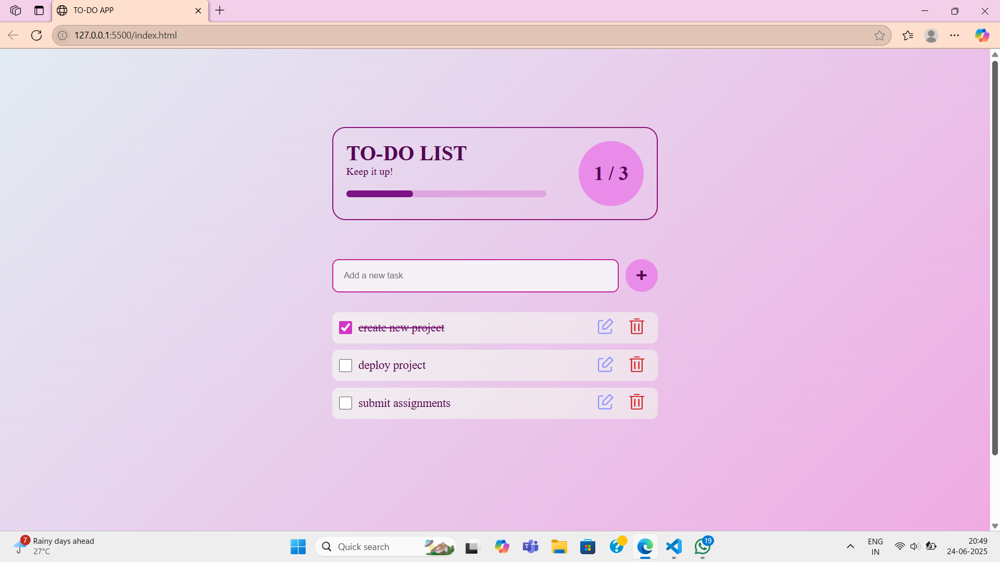

# To-Do-List

A beautifully designed, responsive To-Do List web app built using **HTML**, **CSS**, and **JavaScript**, with persistent storage powered by the browser's **localStorage**. This project helps users manage tasks effectively with an intuitive interface and interactive progress tracking.

---

## 🚀 Features

- ✅ Add new tasks with a single click
- 📋 View all tasks in a clean list format
- ✅ Mark tasks as completed
- 🖊️ Edit tasks instantly
- 🗑️ Delete tasks with ease
- 📊 Dynamic progress bar that updates as you complete tasks
- 🎉 Confetti animation when all tasks are completed
- 💾 Tasks are stored in **localStorage** (no backend needed)
- 📱 Fully responsive design – works on all screen sizes

---

## 🖼️ Screenshots

---

## 🔧 Technologies Used

- **HTML5** – for structure
- **CSS3** – for styling and layout
- **JavaScript (Vanilla)** – for interactivity and logic
- **localStorage** – for persistent task storage
- **Font Awesome** – for icons
- **confettijs** – for celebratory animations

---

## 📁 Project Structure

